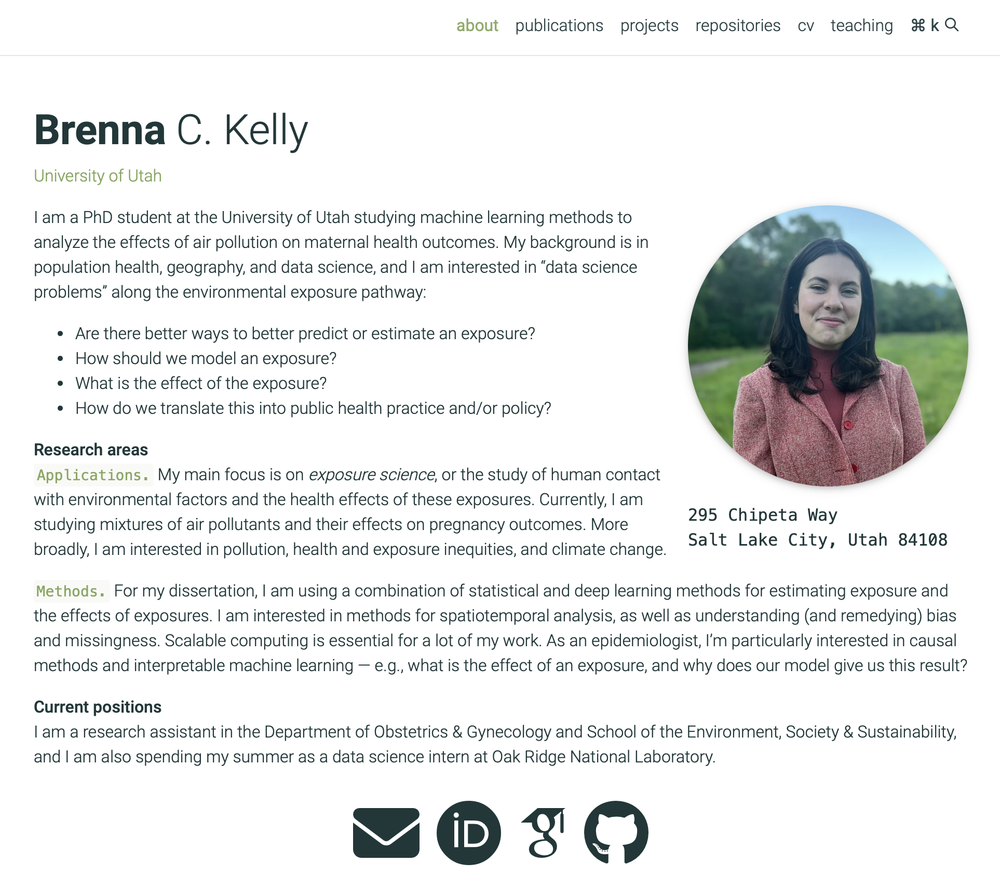

## about me
Hello! I'm Brenna Kelly, a PhD student at the University of Utah studying machine learning  
methods to analyze the effects of air pollution on maternal health outcomes.

## education
**PhD Population Health Sciences**, in progress  
Clinical & Translational Epidemiology Emphasis  
University of Utah

**MS Geography**, 2023  
University of Utah  

**BUS Population Health Science**, 2021  
University of Utah  

## research interests  
**Methods**  
•	Spatiotemporal data analysis • Deep learning with environmental data • Causal inference  
•	Multiscale modeling • Interpretable machine learning • Bias and missingness  
•	Data visualization • NLP • Scalable computing  

**Applications**  
•	Environmental exposures • Population & maternal health • Air pollution  
•	Industrial chemical pollution • Health disparities • Climate change, heat, wildfires

## webpage
To read about my research projects, access teaching materials, and find my CV:  
[https://brenna-c-kelly.github.io](https://brenna-c-kelly.github.io)

